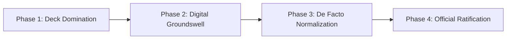

> [!CAUTION]
> **CLASSIFIED COHORT MEMORANDUM // EYES ONLY**
> **Distribution**: P3MD MBA Class & Working Groups
> **Subject**: Operation New Crest — Phasing Out the Legacy Mark & Codifying Our Official Insignia

---

# 🦅 Operation New Crest: The Case for the Official P3MD Insignia

  
  
<em>The Next-Generation P3MD Emblem — Precision, Resilience, and Executive Leadership.</em>

---

## 🎯 The Discovery

If you're reading this, you didn't just browse the curriculum—you investigated the architecture. You clicked the insignia.

Consider this our informal strategy war room. We are here to address something fundamental to our cohort’s collective equity: **our visual identity**.

---

## 💼 The Strategic Imperative: Why We Must Replace the Legacy Logo

In business and organizational strategy, **brand equity is not cosmetic; it is cognitive anchoring**.

Our previous logo served an administrative purpose in the early days. But let’s be candid:

1. **Lack of Executive Gravity**: The legacy mark fails to reflect the caliber, rigor, and dynamic ambition of the leaders sitting in this room.
2. **Visual Fragmentation**: In group presentations, cross-cohort case competitions, and external company pitches, our visual representation has been inconsistent.
3. **The Signaling Deficit**: An executive MBA cohort represents tomorrow's boardroom decision-makers. Our insignia must project velocity, institutional prestige, and high-impact competence.

This new iteration has been engineered to solve that deficit. It is bold, modern, unmistakably prestigious, and instantly recognizable.

---

## 🏛️ Emblem Anatomy & Design Philosophy

> [!NOTE]
>
> ### ✍️ [AUTHOR PLACEHOLDER: PHILOSOPHY & SYMBOLISM]
>
> _This section is reserved for the author to articulate the core design philosophy, narrative vision, and symbolic architecture of the new crest. Replace the sections below with your exact rationale._

### 1. ⭐ The Guiding Star

> **[Placeholder: Detail the significance of the star]**
> _(e.g., Symbol of excellence, moral compass, high aspiration, or foundational values guiding our managerial decisions.)_

### 2. 🦅 The Falcon / Eagle Silhouette (The 'D')

> **[Placeholder: Detail the significance of the eagle/falcon head and wing structure within the letter 'D']**
> _(e.g., Vision, strategic foresight, soaring above operational complexities, leadership acuity, or national Garuda heritage.)_

### 3. 🌿 The Flanking Wreaths (Cotton & Laurel)

> **[Placeholder: Detail the meaning of the flanking wreaths on the left and right]**
> _(e.g., The classic triumph of academic achievement paired with the Indonesian heritage of prosperity, resilience, and shared community welfare.)_

### 4. ⚡ Typographic Momentum & Slant

> **[Placeholder: Explain the typography, speed slant, and geometric weight of 'P3MD']**
> _(e.g., Aerodynamic forward tilt symbolizing rapid adaptation, decisive execution, and continuous transformation in turbulent markets.)_

### 5. 🌓 Monochromatic Contrast & Executive Versatility

> **[Placeholder: Detail the rationale behind the high-contrast black-and-white architecture]**
> _(e.g., Seamless performance across light and dark interfaces, executive pitch decks, embossed leather stationery, and graduation regalia.)_

---

## 🗺️ The Stealth Hegemony Playbook: How We Push the Narrative

We don't need a bureaucratic committee debate to replace the legacy logo. We apply classic **Decentralized Change Management** and create a **Fait Accompli**:

### Phase 1: Deck Domination (Visual Infiltration)

- **The Tactic**: Beginning immediately, place the new crest on the title slide and executive summary of every group case submission (from MK 1 through MK 6).
- **The Outcome**: Faculty, external guest evaluators, and seminar leaders will see this mark repeatedly. It becomes cognitively anchored as the standard.

### Phase 2: Digital Groundswell

- **The Tactic**: Swap this logo into our WhatsApp group icons, shared Google Drive project folders, study circle repos, and informal sprint dashboards.
- **The Outcome**: Ubiquity creates familiarity. Familiarity builds psychological preference.

### Phase 3: De Facto Normalization

- **The Tactic**: When anyone asks for "the cohort logo," provide this new high-resolution asset without hesitation. If anyone asks about the legacy logo, the response is simple: _"That was the provisional mark; this is the finalized executive iteration."_
- **The Outcome**: The old mark fades quietly into archival history.

### Phase 4: Official Ratification

- **The Tactic**: When the student board or university administration initiates batch orders for cohort merchandise, varsity jackets, or graduation booklets, this crest will already have 100% cohort recognition.
- **The Outcome**: Official adoption is frictionless because the entire cohort already considers it our identity.

---

## 📥 Cohort Asset Kit

Download and deploy the official vector/high-resolution PNG asset directly:

- **Official Master Asset**: `static/logo.png`
- **Transparent ARGB Resolution**: `1024 × 240 px`
- **Recommended Usage**: Title slides, header banners, dark/light slide master layouts.

---

## 🤝 The Cohort Pledge

> _"A brand is not what we tell people it is. It is what we consistently embody, present, and defend."_

Own the narrative. Elevate the cohort. Make the crest official.

---

  <a href="/" class="internal">← Return to MBA Cohort Knowledge Base & Academic Portal</a>

