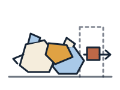

<section class="socratica-stage">

  
P3MD Nawasena Cohort · SBM ITB

  <h1 class="socratica-title">What do you want to learn today?</h1>
  
Select a core course to explore lecture notes, analytical frameworks, and case discussions, or browse program architecture below.

  <h2>Core courses</h2>
  <a href="courses/">Browse the course hub →</a>

  <!-- CARD 1: MK 1 - Organizational Behaviour & Managing People -->
  <a href="courses/mk1-organizational-behavior-managing-people" class="socratica-card card-mk1">
    

      MK 001
      
Organizational Behaviour &amp; Managing People

    

    

      
    

  </a>

  <!-- CARD 2: MK 2 - Financial Management and Strategy -->
  <a href="courses/mk2-financial-management-strategy" class="socratica-card card-mk2">
    

      MK 002
      
Financial Management and Strategy

    

    

      
    

  </a>

  <!-- CARD 3: MK 3 - Marketing Management -->
  <a href="courses/mk3-marketing-management" class="socratica-card card-mk3">
    

      MK 003
      
Marketing Management

    

    

      
    

  </a>

  <!-- CARD 4: MK 4 - Operations and Supply Chain Management -->
  <a href="courses/mk4-operations-supply-chain-management" class="socratica-card card-mk4">
    

      MK 004
      
Operations and Supply Chain Management

    

    

      
    

  </a>

  <!-- CARD 5: MK 5 - Problem Solving, Decision Making and Negotiation -->
  <a href="courses/mk5-decision-making-negotiation" class="socratica-card card-mk5">
    

      MK 005
      
Problem Solving, Decision Making and Negotiation

    

    

      
    

  </a>

  <!-- CARD 6: MK 6 - Applied Business Analytics -->
  <a href="courses/mk6-business-analytics" class="socratica-card card-mk6">
    

      MK 006
      
Applied Business Analytics

    

    

      
    

  </a>

</section>

  

    
Beyond the core

    <h2>Additional learning</h2>
  

  <!-- CARD 7: Bonus - PeopleMath -->
  <a href="courses/bonus-peoplemath" class="socratica-card card-bonus">
    

      ELECTIVE 001
      
Bonus: PeopleMath

    

    

      
    

  </a>

  <!-- CARD 8: Action Learning Project (ALP) -->
  <a href="program/action-learning-project" class="socratica-card card-alp">
    

      BUMN CAPSTONE
      
Action Learning (ALP)

    

    

      
    

  </a>

  

    
Program &amp; Governance

    <h2>Program architecture</h2>
  

  <a href="program/">Browse the program hub →</a>

  <a href="program/">Program architecture →</a>
  <a href="program/learning-journey">Learning journey →</a>
  <a href="program/academic-calendar">Academic calendar →</a>
  <a href="program/action-learning-project">ALP blueprint →</a>
  <a href="program/faculty-directory">Faculty directory →</a>

The P3MD MBA transformation operates on an integrated **70–20–10 adult learning model** designed for high-impact decision-making and cross-functional execution:

- **[[program/index|Program Architecture Hub]]**: Institutional overview, governance structure, and core design logic.
- **[[program/learning-journey|Learning Journey & 70-20-10 Pedagogy]]**: The 5 transformation pillars, session distribution (868 experiential, 196 social, 112 formal), and cohort-to-individual scaling.
- **[[program/action-learning-project|Action Learning Project (ALP) Blueprint]]**: 6 SMART-gated stages across 10 partner BUMNs, Milestone gates (M1–M3), and the Social Project.
- **[[program/academic-calendar|Academic & Synchronization Calendar]]**: Master 16-week timeline synchronizing lectures, case sessions, CEO guest lectures, exams, and ALP gates.
- **[[program/faculty-directory|Faculty & Course Assistant Directory]]**: Comprehensive roster of SBM ITB Lead Faculty, co-lecturers, and Course Assistants with phone contacts.
